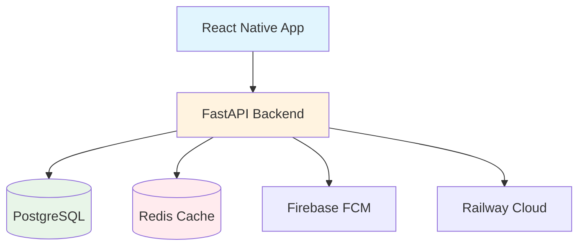
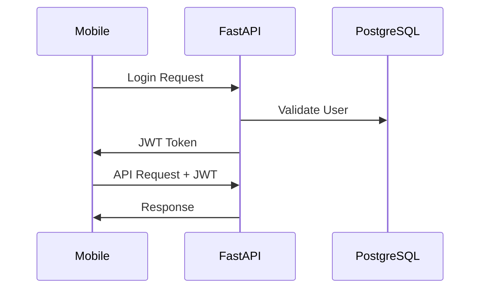
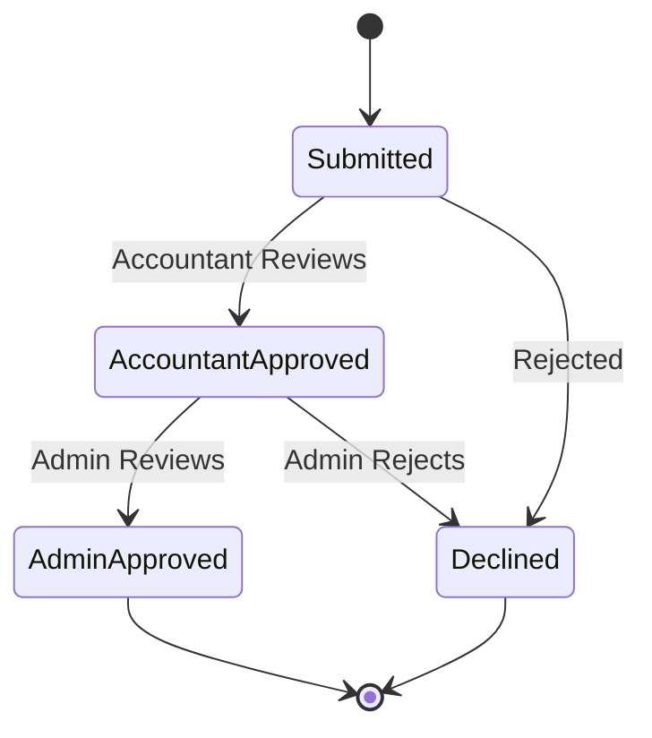

# Jaskirat Textiles - Money Management System

A comprehensive, secure payment management system built for textile industry operations with role-based access control, automated workflows, and real-time notifications.

## 🏗️ System Architecture



## 🔐 Authentication Flow



## 💰 Payment Process



## 🔧 Tech Stack

**Backend:**
- FastAPI (Python web framework)
- PostgreSQL (Database)
- SQLAlchemy + Alembic (ORM & migrations)
- Redis (Rate limiting)
- SlowAPI (Rate limiting middleware)
- APScheduler (Background tasks)
- JWT Authentication
- bcrypt (Password hashing)

**Mobile:**
- React Native + Expo
- Redux Toolkit (State management)
- expo-secure-store (Token storage)

**Infrastructure:**
- Docker + docker-compose
- Railway (Cloud deployment)
- Firebase Cloud Messaging

## 📱 Key Features

### What's Actually Built:
- ✅ **Role-based Authentication** (Admin/Accountant/Executive)
- ✅ **Payment Management** with two-stage approval
- ✅ **Rate Limiting** on all 56 API endpoints
- ✅ **Legacy Data Import** from .DBF files
- ✅ **Real-time Notifications** via Firebase
- ✅ **Automated Scheduling** for overdue alerts
- ✅ **Mobile App** with secure token management
- ✅ **Company & Bill Management**
- ✅ **Comprehensive Testing** (56+ test files)
- ✅ **Production Deployment** on Railway

### User Workflows:
1. **Executive**: Submit payments for assigned companies
2. **Accountant**: Review and approve/decline payments
3. **Admin**: Final approval + user/system management
4. **System**: Auto-notify on overdue bills and pending approvals

## 🔄 API Endpoints (Key Routes)

```
Authentication:
POST /auth/login              # Login with username/password
GET  /auth/me                 # Get current user info

Payments:
POST /payments                # Submit payment
GET  /payments/{id}           # Payment details
POST /accountant/payments/{id}/approve
POST /admin/payments/{id}/approve

Companies & Bills:
GET  /companies               # List companies
GET  /companies/{code}/bills  # Company bills
PATCH /companies/{code}/promise # Update promise date

Admin:
GET    /admin/users           # User management
POST   /admin/users           # Create user
POST   /uploads/master        # Import .DBF files
POST   /admin/notifications/scan # Trigger notifications
```

## � Quick Start

```bash
# Backend
cd backend
docker-compose up --build
# API available at http://localhost:8000

# Mobile App  
cd payments
npm install
npx expo start
```

**Default login:** admin / admin

## 🤝 Contributing

1. Fork the repository
2. Create a feature branch
3. Implement changes with tests
4. Submit a pull request

## 📄 License

This project is proprietary software developed for Jaskirat Textiles.

---

**Built with ❤️ for the textile industry** | **Powered by FastAPI + React Native**
